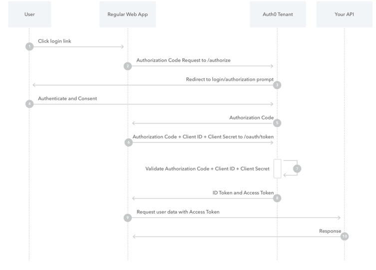

# Read-11

## Readings

Article Content Source:
[What is OAuth? How the open authorization framework works](https://www.csoonline.com/article/3216404/what-is-oauth-how-the-open-authorization-framework-works.html)

## OAuth

What is it?
Deals with Authentication, it is a secure 3rd party-Useragent for delagation authorization

History?
Created/Supported by Google/Twitter as an open standard

Uses?
can go to website and login using social media outlets like Google/Facebook etc.

Explanation?
remember that OAuth, there are 2 unrelated services and the user, where approvals are needed for 'transactions' to occur
OAuth is about AUTHORIZATION not authentication
  authentication is: user proving their own identity using password
  authorization is: letting subject access to resources AFTER successfull authentication
It is like a valet key and not the master key

It is a FRAMEWORK not a protocol

Only works with HTTPS

## How OAuth Works

1. user has signed into website One
2. user initiates transaction that needs access to unrelated service to website Two
3. Website One connects to website Two on behalf of user using OAuth
4. Website Two generates 1-time token
5. Website One give token/secret to user's client software
6. Client's software present request token/secret 2nd authorization provider
7. User approves transaction type at website one
8. User given approved access token
9. Website One give access token to Website Two as proof of authentication
10. Website Two lets Website One access their site on behalf of user
11. User is notified of successful transaction

What makes OAuth successfull it that it is easy to adopt and create on apps

### [top of page](#-Read-11)

### [home page](/README.md)

## Auth0

Auth0 Docs
[Authentication and Authorization Flows](https://auth0.com/docs/flows)

Auth0 uses:
- Open ID Protocol

- OAuth 2.0 Authorization Framework
for Authentication and Authorization to access protected resources

authentication is: verifying who a user is via protocol
authorization is: verifying what they(site) access via framework

- Authorizeation Code Flow

for server side web apps

- Authorization Code Flow with Proof Key for Code Exchange

for mobile/native apps

- Implicit Flow with Form Post

an alternative to Authorization Code Flow and is used for Public Clients/apps UNABLE to store Client Secrets

Not Best Practice

- Hybrid Flow

apps able to securely store Client Secrets

combines features:

  - Authorization Code Flow
  - Implicit Flow
  - Form Post

this allows app to have immediate access to ID Token and allows retrieval of access/refresh Tokens.

Useful for apps that need immediate access info about user, but must perform processing? before gaining access to user resources for x-amount of time

- Client Credentials Flow

for Machine to Machine apps, services running on back-end
This flow authenticates/authorizes the app, not the user

- Device Authorization Flow

send link to user to authorize versus authenticate

- Resource Owner Password Flow

Not recommended

### [top of page](#-Read-11)

### [home page](/README.md)

Auth0 Docs
[Auth0 React SDK for Single Page Apps](https://auth0.com/docs/libraries/auth0-react)

### [top of page](#-Read-11)

### [home page](/README.md)
